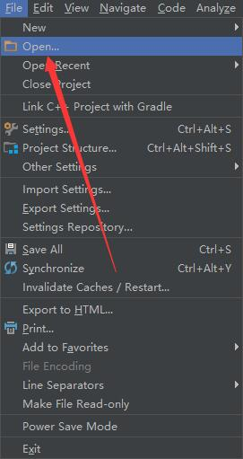
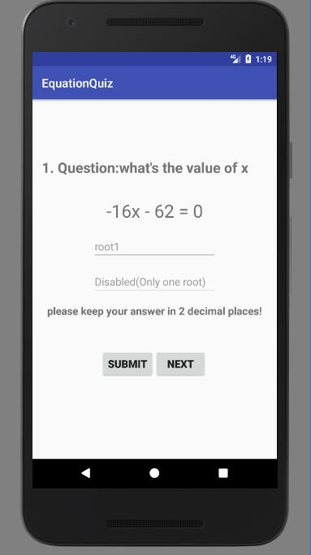
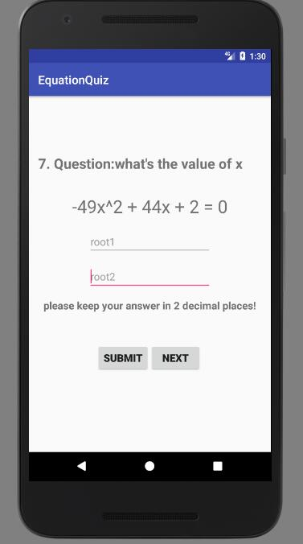
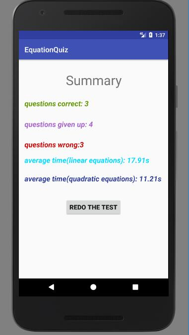
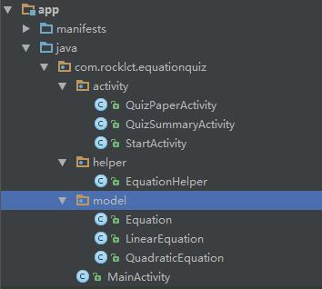

## Equation Quiz
this is a quiz application to help you exercise your ability to solve equation problems.

### import the project
The application is developed by Android studio. So you can import this project to Android studio easily.

Just click the open project in Android studio,and improt it.

### features
you can start to do a equation test each time through this application.Each test has **10 questions**.The first 5 questions are **linear equations** while the last 5 are **quadratic**.

following are the previews of the test.

you are supposed to answer the question correctly.If the answer is not integer,you should **keep your answer in 2 decimal places**.

You can also leave the answer blank and click NEXT directly if you can not calculate the answer.Doing so, you are regarded as giving up this question.

After completing your test, you will see a summary which summarize the information for your test. For example,it will show the number of questions you answer correctly wrongly.Also, your average time of solving problems will be shown to you.

### code structure
The application includes 3 packages

 - activity
 - helper
 - model

EquationHelper.class is a class wrriten to encapsulate the tool functions to operate the equation class.
